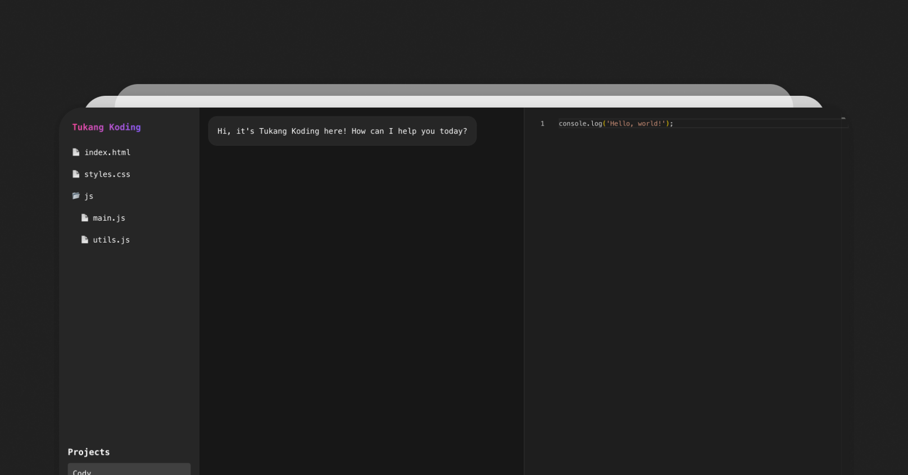

# Tukang Koding

Tukang Koding is a simple chatbot that runs on your local machine. It can help you work on your codebase. Think of it like asking ChatGPT to edit your files, but instead of copying and pasting your code, it has direct access to your codebase. It can read, edit, update, and delete files for you.

