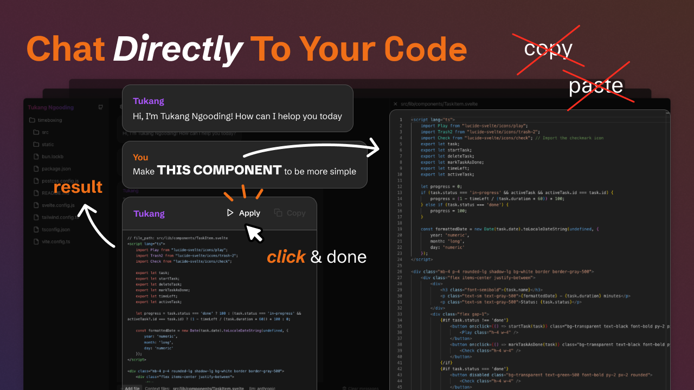

# Tukang Ngooding



Tukang Ngooding is a simple chatbot that runs on your local machine. It can help you work on your codebase. Think of it like asking ChatGPT to edit your files, but instead of copying and pasting your code, it has direct access to your codebase. It can read, edit, update, and delete files for you but with your permission of course.

## Installation

1. Clone the repository
```
git clone https://github.com/ahmadrosid/tukang-ngooding.git
```
2. Copy example env
```
cp .env.example .env.local
```
Make sure to fill in the `ANTHROPIC_API_KEY=` and `CURRENT_DIRECTORY=` environment variables.

3. Install dependency with your favourite package manager
```
bun install
pnpm install
npm install
```
4. Run development server
```
bun run dev -- --open
```

